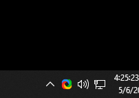
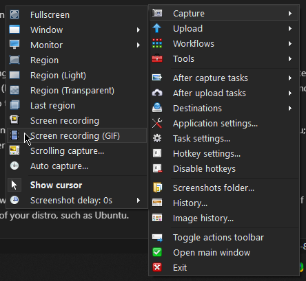
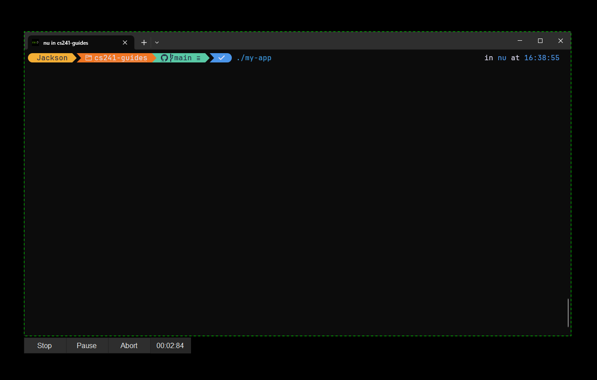
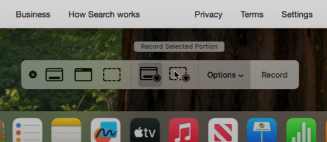

When submitting for assignments that have any sort of motion visuals (SFML, terminal apps, etc.), a video is ~~made up of~~ worth a thousand pictures. This is a simple guide to record such a video (or a GIF) on multiple platforms.
## Platforms
### Windows
On Windows, the built in snipping tool can be used to record a window; [here is an official guide from Microsoft on how to use it.](https://www.microsoft.com/en-us/windows/learning-center/how-to-record-screen-windows-11).

**However**, I find this tool to be cumbersome and imprecise. The single best tool on Windows is ShareX, which allows for trivial recording of specific windows, as well as re-encoding them in efficient formats with the inlcuded FFMPEG installation.

To install it, open your Windows shell of choice (likely PowerShell) and run:
```sh
winget install ShareX.ShareX -s winget
```
From there, you'll want to start it, at which point the tray icon should be visible.



Right-click on this icon and select **Capture --> Screen Recording (GIF)** as shown below:


From there, the visual selection tool will appear, and will snap to whatever window you'd like; left-clicking will begin the recording. You can also hold left-click to select a custom region, after which releasing the mouse button will begin the recording.



Select **Stop** to finish the recording; after it is done encoding the final GIF, it will automatically put it in your clipboard. To find the GIF later, you can right click on the icon again and go to **History**, which will contain a list of all the media files you've recorded.

### MacOS
The keybind `Shift-Command-5` opens the built-in screen capture tool.



From there, select **Record Selected Portion** as shown in the screenshot, and use the selection tool to hover over your window. Then, hit **Record**. 

Once you are finished recording, you can edit the final file, or it will save to your desktop. 

[See the official Apple guide](https://support.apple.com/en-us/102618), or see the linked video to see a visual representation: [spill the goods - *How to Screen Record on a Mac*](https://www.youtube.com/watch?v=LP7FstUL_Uo) (screenshot source is from this video.)

### Linux
On Linux, the recording tool of choice is going to depend on a variety of factors, mostly related to the type of desktop environment (DE) you're using, specifically whether it's an X11-based DE or a Wayland-based DE. These are divided into their own subsections.

Note that if you're using Windows Subsystem for Linux (WSL), then this *does not* apply to you; you would still use ShareX (or another software) to do the recording.

KDE Plasma has its own recorder, [Spectacle](https://apps.kde.org/spectacle/), which is fairly similar to ShareX in terms of the user interface. It should be available for both the X11 and Wayland versions. It may even work for other environments, but it depends on your configuration. 

GNOME has a built-in screen recorder that can be activated with `Shift+Ctrl+Alt+R`, but it's not very granular; it can only record the entire screen, and you'll need to re-encode as a GIF (with FFMPEG, which may or may not be pre-installed):

```sh
ffmpeg -i <your file>.ext -vf "fps=20,scale=480:-1:flags=lanczos" -c:v gif -q:v 15 <your file>.gif
```

For Wayland-based DEs, the way I do it on is as follows:

First, install the following apps with your package manager:
- [**wf-recorder**](https://github.com/ammen99/wf-recorder) - This is the actual recording app, which uses FFMPEG to encode as necessary. It's quite flexible.
- [**slurp**](https://github.com/emersion/slurp/) - This simple software lets you select a screen region, outputting it as a dimension which can be used by wf-recorder.
- (optional) [**grim**](https://sr.ht/~emersion/grim/) - This is a screenshot utility by the creator of `slurp`. It's not necessary for this guide, but if you want to take screenshots as well as recordings, you'll need this.

Run `mkdir -p "$HOME/Videos"`; this is where the screen recording will be located. From there, you'll want to use the following command: 
```sh
wf-recorder --geometry "$(slurp -d)" -F fps=20 -c gif -f "$HOME"/Pictures/Captures/"$(date +%d-%H:%M)".gif
```
This will:
1) Open `slurp`, letting you select a screen region
2) Start recording the screen, continuing until it's killed directly
3) Encode the file as a 20FPS GIF and put it in the location, with the filename as the current <day>-<hour>:<minute>

How you run this program is up to you; you can do it in another terminal and kill it manually with `Ctrl`-`C`, but this is tedious. Your best option is to modify it slightly:
```sh
pkill wf-recorder || wf-recorder --geometry "$(slurp -d)" -F fps=20 -c gif -f "$HOME"/Videos/"$(date +%d-%H-%M)".gif
```
and bind this command to a key, e.g. `Shift + PrintScrn`, which will
1) Check for a running instance of wf-recorder and kill it
2) If it doesn't exist, it starts a new one, meaning that it both activates and deactivates it.