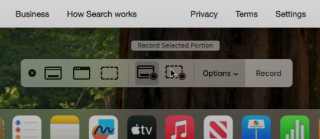

When submitting for assignments that have any sort of animation (SFML, terminal apps, etc.), a video is ~~made up of~~ worth a thousand pictures. This is a simple guide 
## Platforms
### Windows
On Windows, the built in snipping tool [Here is an official guide from Microsoft on how to use it.](https://www.microsoft.com/en-us/windows/learning-center/how-to-record-screen-windows-11).

**However**, the single best tool on Windows is ShareX, which allows for trivial recording of specific windows, as well as re-encoding them in efficient formats with the inlcuded FFMPEG installation.

To install it, open your Windows shell of choice (likely PowerShell) and run:
```
winget install ShareX -s winget
```
### Linux
On Linux, the recording tool of choice is going to depend on a variety of factors, mostly related to the type of desktop environment (DE) you're using, specifically whether it's an X11-based DE or a Wayland-based DE. These are divided into their own subsections.

Note that if you're using Windows Subsystem for Linux (WSL), then this *does not* apply to you; you would still use ShareX (or another software) to do the recording.

#### X11 
X11 is an older windowing system which is slowly being phased out. That said, it's still likely if you're using older/stable versions of your distro, such as Ubuntu.

#### Wayland
Here are some DE-specific implementations:
- **KDE Plasma - [https://apps.kde.org/spectacle/](Spectacle)** is fairly similar to ShareX in terms of the user interface. 

The agnostic way, which is the way I do it on my DE of choice (Hyprland) is as follows:

First, install the following apps with your package manager:
- [**wf-recorder**](https://github.com/ammen99/wf-recorder) - This is the actual recording app, which uses FFMPEG to encode as necessary. It's quite flexible.
- [**slurp**](https://github.com/emersion/slurp/) - This simple software lets you select a screen region, outputting it as a dimension which can be used by wf-recorder.
- (optional) [**grim**](https://sr.ht/~emersion/grim/) - This is a screenshot utility by the creator of `slurp`. It's not necessary for this guide, but if you want to take screenshots as well as recordings, you'll need this.

Run `mkdir -p "$HOME/Pictures/Captures`; this is where the screen recording will be located. From there, you'll want to use the following command: 
```
wf-recorder --geometry "$(slurp -d)" -F fps=20 -c gif -f "$HOME"/Pictures/Captures/"$(date +%d-%H:%M)".gif
```
This will:
1) Open `slurp`, letting you select a screen region
2) Start recording the screen, continuing until it's killed directly
3) Encode the file as a 20FPS GIF and put it in the location, with the filename as the current <day>-<hour>:<minute>

How you run this program is up to you; you can do it in another terminal and kill it manually with `Ctrl`-`C`, but this is tedious. Your best option is to modify it slightly:
```sh
pkill wf-recorder || wf-recorder --geometry "$(slurp -d)" -F fps=20 -c gif -f "$HOME"/Pictures/Captures/"$(date +%d-%H:%M)".gif
```
and bind this command to a key, e.g. `Shift + PrintScrn`, which will
1) Check for a running instance of wf-recorder and kill it
2) If it doesn't exist, it starts a new one, meaning that it both activates and deactivates it.

### MacOS
The keybind `Shift-Command-5` opens the built-in screen capture tool.



From there, select **Record Selected Portion** as shown in the screenshot, and use the selection tool to hover over your window. Then, hit **Record**. 

See the linked video to see a visual representation. Source: [spill the goods - *How to Screen Record on a Mac*](https://www.youtube.com/watch?v=LP7FstUL_Uo)
